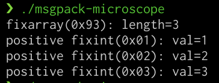

# README

MessagePackのhexを可読可能な形に置き換える

[nokute78/msgpack-microscope](https://github.com/nokute78/msgpack-microscope) あたりにあげてゴニョゴニョするよう

*messagepack2hex.py:L6* を 適切に書き換える

```shell-script
 $ mitmdump -s messagepack2hex.py
```

サンプルで配信サーバーもくっついてます

### msgpack-microscope を使ってサンプルサーバーのデータをパースしている場合

